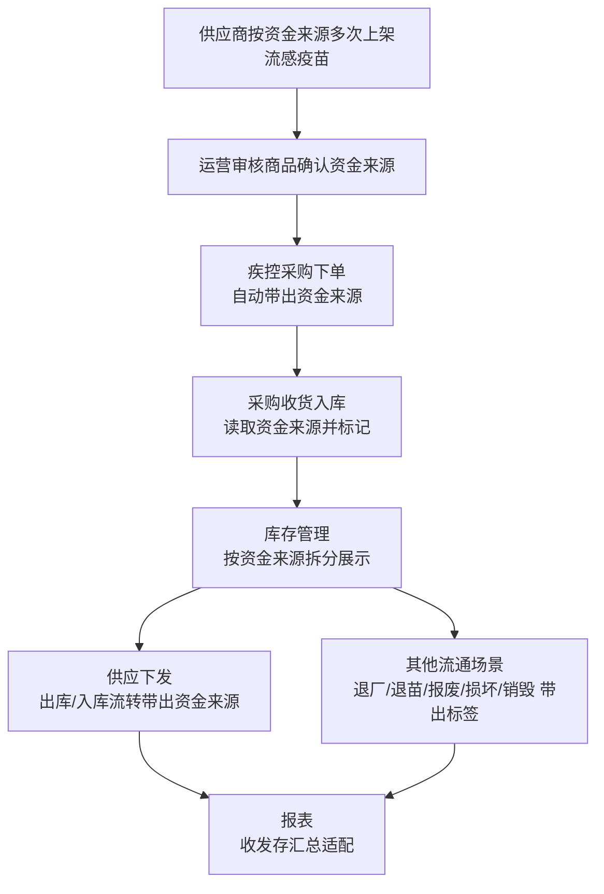

# 免疫规划 - 疫苗馆 - 农村流感项目1期-疫苗流通相关改造

## 模块基础信息

## 关键词

供应单收货, 供应单管理, 供应管理, 损坏, 收货, 期初扫码关联, 流感疫苗, 疫苗类目, 疫苗采购资金来源, 疫苗馆, 目标维度, 移库, 资金来源准确性, 销毁

| 字段 | 值 |
|------|-----|
| 关联部门 | 免疫规划 |
| 二级部门 | 免疫规划组 |
| 产品 | 疫苗 |
| 产品线 | 免疫规划 |
| 附录 | 附录2 |

## 双向链接

| 链接类型 | 目标 |
|---------|------|
| 📇 **关键词索引** | [关键词索引.md](../../../ProjectSkill/projects/共享模块中心/关键词库/关键词索引.md) |
| 📁 **模块文件** | [共享模块中心/免疫规划组/](../../../ProjectSkill/projects/共享模块中心/免疫规划组/) |
| 📊 **报表** | [2026报表数据知识库/周报/](../../../2026报表数据知识库/周报/) |
| 🗺️ **中央枢纽** | [双向链接枢纽.md](../../../ProjectSkill/projects/共享模块中心/双向链接枢纽.md) |

## 版本迭代时间线【总目录】

| 版本迭代时间 | 版本所属一级菜单 | 二级菜单 | 产品业务版本内容关键词 |
|------------|----------------|---------|---------------------|
| 【疫苗馆】农村流感项目1期-疫苗流通相关改造 | 疫苗 | - | 疫苗馆 |

---

### 疫苗馆 - 农村流感项目1期-疫苗流通相关改造

**菜单路径：** 疫苗

**版本内容：**

## 一、背景与目标

### 1、背景

农村流感项目要求对不同资金来源的流感疫苗进行独立管理与可追溯流转。当前疫苗流通环节（采购下单、收货入库、库存管理、供应下发、各类出入库）中，同一流感疫苗商品不区分采购资金来源，无法满足省疾控对中央财政、地方财政、自筹、捐赠等不同资金来源疫苗分别核算与流转的业务要求。

经研发评估，原"同一商品拆分资金来源属性"方案改造影响面过大。经省疾控确认，调整为：供应商按不同资金来源多次上架同一流感疫苗商品，下单与流转环节根据商品自动关联资金来源，以最小改造成本实现资金来源区分与全程标记。

本次改造定位为：在流感疫苗全流通链路中，自动识别并标记【疫苗采购资金来源】，在采购、入库、库存、供应、各类出入库及报表中按规则展示，并按资金来源对库存进行拆分管理。

### 2、目标与交付内容

| 目标维度 | 衡量指标 |
| --- | --- |
| 资金来源准确性 | 流感疫苗资金来源标记准确率 = 百分之百 |
| 流转链路完整性 | 资金来源标签在采购→入库→库存→供应→出入库全链路贯通 |
| 库存核算独立性 | 不同资金来源的同款流感疫苗可独立拆分核算 |
| 历史数据一致性 | 存量流感疫苗数据完成资金来源订正 |

交付项1：采购下单环节，符合条件流感疫苗自动带出【疫苗采购资金来源】（含开启预购单、关闭预购单两种下单流程）。

交付项2：采购收货入库环节，根据采购订单关联的流感疫苗商品自动读取资金来源，入库单列表/详情及收货工作台展示（PC端、PDA端、第三方批量收货场景）。

交付项3：库存管理改造，仓库库存、总库存管理、在库信息查询增加【疫苗采购资金来源】与【疫苗类目】字段标签及筛选，按资金来源拆分展示，导出适配。

交付项4：库存其他功能适配，销毁、损坏、期初扫码关联、移库（扫码移库、一键移库、移库记录）展示资金来源标签。

交付项5：疫苗供应单全流程适配，供应单创建（报苗计划转入、新建）、供应出库、供应入库（含退回）展示资金来源，覆盖 PC 端与 PDA 端。

交付项6：其他疫苗流通场景适配，退厂、退苗、报废、损坏、销毁等各类出入库单据展示资金来源标签，库存联动更新。

交付项7：报表改造，收发存汇总表、收发存汇总表（按效期）适配资金来源字段。

---

## 二、用户、权限与入口

### 1、用户、权限与入口（表）

| 用户/角色 | 使用入口 | 可见内容 | 可操作内容 | 限制说明 |
| --- | --- | --- | --- | --- |
| 供应商 | 疫苗馆-订单列表（发货） | 待发货流感疫苗订单及商品 | 按订单发货、维护批号/储位/物流 | 供应商按资金来源多次上架商品；发货沿用既有流程 |
| 政采云运营人员 | 商品审核（既有入口） | 待审核流感疫苗商品及资金来源信息 | 审核商品、确认资金来源 | 资金来源信息无误后方可审核通过 |
| 省级疾控 / 宁波疾控 | 采购大厅、收货工作台、库存管理、供应管理、各类出入库 | 流感疫苗资金来源标签 | 采购下单、收货、库存查询、供应下发 | 资金来源由商品自动关联，不可手动修改 |
| 地市级 / 区县级疾控 | 同上（按数据权限范围） | 本级及下级可见数据 | 采购下单、收货、库存查询、供应下发 | 同上 |
| 接种门诊 | 收货工作台、库存管理、在库信息查询、移库/销毁/损坏 | 本门诊库存及资金来源标签 | 供应收货、库存查询、库存操作 | 资金来源不可手动修改 |

### 2、页面范围（用于交底对齐）

| 页面/区域 | 用途 | 本次改造点 |
| --- | --- | --- |
| 采购大厅/购物车/订单确认页 | 疾控下单 | 符合条件流感疫苗自动带出资金来源 |
| 入库管理-收货工作台-发货单收货 | 采购收货 | 展示资金来源标签 |
| 入库管理-采购入库单（列表/详情） | 入库结果查看 | 展示资金来源 |
| 库存管理-仓库库存 / 总库存管理 | 库存核算 | 增加字段、筛选、按资金来源拆分 |
| 库存管理-在库信息查询 | 库存查询 | 仅"按储位查看"分页增加标签 |
| 库存管理-销毁/损坏/期初扫码关联/移库 | 库存操作 | 展示资金来源标签 |
| 供应管理-供应单管理 / 出库单 / 入库单 | 供应流转 | 创建、出库、入库（含退回）展示标签 |
| 出库管理/入库管理-退厂/退苗/报废/损坏/销毁等 | 各类流通 | 单据创建与出入库展示标签 |
| 报表-收发存汇总表 / 收发存汇总表（按效期） | 库存报表 | 适配资金来源字段 |

---

## 三、场景与功能规则

### 1、整体业务流程

### 2、功能场景说明

### 场景一：采购下单-名称中展示疫苗采购资金来源标记&疫苗商品资金来源配置

**触发条件：**疾控在采购大厅下单，且选购商品为符合条件的流感疫苗。

**前置条件：**

**①供应商已按资金来源上架商品，运营已审核通过；**

**②系统已维护流感疫苗商品与资金来源的对应关系。**

**触发入口：**采购大厅 → 购物车 → 订单确认页。

**系统规则：**商品名称中展示疫苗采购资金来源标记

**数据影响：**资金来源随订单生成写入，作为后续入库、库存、流转的数据基准。

**结果口径：**下单成功的流感疫苗订单，商品维度携带对应的资金来源。

**示例**：上海生物/流感病毒裂解疫苗（裂解6月龄及以上）/0.5ml/支/2025年（中央财政）

### 场景二：采购收货入库

**触发条件：**供应商发货后，疾控在收货工作台对发货单操作收货。

**前置条件：**发货单关联的采购订单中包含流感疫苗商品，且已携带资金来源。

**触发入口：**入库管理-收货工作台-发货单收货（PC端）、PDA-采购收货、第三方系统批量收货。

**系统规则：**

**①PC端-发货单收货：**进入收货详情，系统判断商品是否为流感疫苗；满足则展示【疫苗采购资金来源】，收货完成后在发货单收货列表及采购入库单列表/详情展示。

**②PC端-一键扫码收货：**存在符合条件流感疫苗时，展示资金来源；展示位置为商品信息下方（与发货单收货、PDA 收货保持一致）。

**③PDA端-采购收货：**收货详情页展示资金来源。

**④第三方批量收货场景：**入库完成后，预防接种系统实时对关联入库单进行数据处理，自动匹配订单-商品并标记资金来源，后续库存展示与流转均以此为准。

资金来源建议统一以页面标签形式展示，改造样式最小。

**页面/弹窗/提示：**商品行/明细展示资金来源标签。

**数据影响：**入库完成后疫苗数据进入库存，按资金来源标记；入库完成后无法手动修改，仅支持联系系统运维进行数据订正。

**结果口径：**入库成功的流感疫苗携带资金来源，并作为库存拆分与后续流转基准。

**操作步骤-PC端：**

步骤1：进入 收货工作台-发货单收货，找到待收货发货单，点击【收货】进入详情。

步骤2：确认流感疫苗商品行展示【疫苗采购资金来源】标签。

步骤3：完成收货，进入采购入库单列表/详情，确认资金来源字段展示。

**操作步骤-PDA端：**

（PDA端）进入以下页面时，展示疫苗采购资金来源。

PDA-采购收货、供应商入库、退后入库、报废入库、一键扫码收货

**操作步骤-接口端：**

（第三方批量收货）由测试提供三方发货单号验证流程，确认入库后资金来源已标记（一键扫码收货截图稍后补充，资金来源展示于商品信息下方）。

### 场景三：库存管理改造

**触发条件：**流感疫苗入库成功产生库存，数据结构需对齐资金来源。

**触发入口：**库存管理-仓库库存、库存管理-总库存管理、查询-在库信息查询、库存管理-库存商品。

**系统规则：**

**仓库库存、库存商品：**列表增加【疫苗采购资金来源】+【疫苗类目】字段标签；筛选项增加对应两个筛选条件。

**总库存管理：**一级列表增加【疫苗类目】（六分类，支持三级类目查询）；二级列表增加【疫苗采购资金来源】字段；筛选项增加两个筛选条件。

**在库信息查询：**列表增加 2 个字段，筛选项增加 2 个筛选条件；仅"按储位查看"分页增加标签，"按单位查看"不展示。

**拆分逻辑：**同类流感疫苗按"疫苗商品-生产企业-批号-【疫苗采购资金来源】"维度拆分展示；商品/企业/批号一致但资金来源不同，则拆为多条独立展示，仓库记录库存分开展示。

**导出适配：**导出文件展示资金来源标签。

**筛选规则：**资金来源下拉枚举（中央财政/地方财政/自筹/捐赠/其他），非必填默认全部；疫苗类目下拉为疫苗六分类，非必填默认全部。

**页面/弹窗/提示：**列表字段标签、筛选项。

**数据影响：**库存按资金来源拆分核算，出库单位与入库单位均更新。

**结果口径：**仅流感疫苗拆分，其他疫苗不变。

**操作步骤（含截图）**：

步骤1：进入仓库库存，确认列表新增【疫苗采购资金来源】【疫苗类目】列及对应筛选项。

步骤2：选择同一商品/企业/批号但不同资金来源的流感疫苗，确认拆分为多条展示。

步骤3：进入总库存管理，确认一级列表疫苗类目、二级列表资金来源字段及筛选项。

步骤4：进入在库信息查询，切换"按储位查看"确认标签；切换"按单位查看"确认不展示标签。

步骤5：操作导出，确认导出文件含资金来源字段。

步骤6：进入，库存商品，查看疫苗采购资金来源。

### 场景四：库存其他功能适配（销毁/损坏/期初扫码关联/移库）

**触发条件：**对已入库流感疫苗库存执行销毁、损坏、期初扫码关联、移库等操作。

**触发入口：**

库存管理-销毁（扫码销毁）

库存管理-损坏（扫码损坏）

库存管理-期初扫码关联

库存管理-移库（扫码移库、一键移库、移库记录）。

盘点功能，已废弃，不涉及本期改造。

**系统规则：**

①各功能页面增加【疫苗采购资金来源】字段标签，流感疫苗展示具体来源，非流感疫苗不展示标签。

②移库：扫码移库、一键移库-选择商品适配、移库记录均展示资金来源标签。

③手动操作限制：手动操作仅支持非疫苗商品及部分类目（注射器、稀释液、PPD、狂犬病人免疫球蛋白、炭疽）；流感疫苗不支持手动修改资金来源。

**页面/弹窗/提示：**操作明细行展示资金来源标签。

**数据影响**：库存操作按资金来源维度记录，不影响其他疫苗。

**结果口径：**库存操作全程保留资金来源标识。

步骤1：打开【销毁】，录入监管码，查看疫苗采购资金来源

步骤2：打开【损坏】，录入监管码，查看疫苗采购资金来源

步骤3：打开【期初扫码关联】，录入监管码，查看疫苗采购资金来源

步骤4：打开【移库】，录入监管码，查看疫苗采购资金来源

### 场景五：疫苗供应单全流程适配

**触发条件：**上级疾控向下级下发流感疫苗，创建供应单并完成出库/入库。

**触发入口：**疫苗报苗计划-疫苗下级报苗记录、供应管理-供应单管理、出库管理-出库单管理、入库管理-入库单管理/收货工作台（PC端及 PDA端）。

**系统规则：**

**供应单创建：**

入口1：疫苗下级报苗记录转入供应单，展示资金来源。

入口2：供应管理-供应单管理新建供应单，展示资金来源。

**供应出库：**

出库流程中展示资金来源标签。

**供应入库：**

正常入库成功，展示资金来源。

**退回入库：**

展示资金来源。

**PDA端：**供应阶段收货详情页展示【疫苗采购资金来源】字段。流感疫苗展示具体来源，非流感疫苗不展示标签。

**页面/弹窗/提示：**供应单创建页、出库单、入库单明细展示标签。

**数据影响：**供应流转全程携带资金来源，出库单位与入库单位库存联动更新。

**结果口径：**供应全链路资金来源标识一致、可追溯。

**操作步骤：**

步骤1：创建供应单

方式1：打开【供应管理】-【供应单管理】，点击【新增】，进入新增页面。

方式2：通过疫苗下级报苗记录，转供应单创建。

步骤2：进入出库管理，找到供应单，可查看疫苗采购资金来源，操作疫苗扫码出库。

步骤3：进入收货工作台-打开【供应单收货】，选择要收货的供应单，查看疫苗采购资金来源，操作收货。

步骤4：操作供应单退货

### 场景六：其他疫苗流通场景适配

**触发条件：**流感疫苗执行退厂、退苗、报废、损坏、销毁等流通操作，或预防接种业务产生使用出库单。

**触发入口：**

供应管理-退苗单管理

供应管理-报废单管理

出库管理（退厂/退苗/报废/损坏/销毁/退货/其他出库）

入库管理（对应各类入库含撤销入库）。

**系统规则：**

单据创建：退厂单、报废单、损坏单、销毁单创建时展示资金来源标签。

出库：退厂出库、退苗出库、报废出库、损坏出库、销毁出库、退货出库、其他出库展示标签。

入库：采购入库、供应入库、供应撤销入库、采购退货入库、供应退货入库、退苗入库、退苗撤销入库、退厂入库、退厂撤销入库、报废入库、报废撤销入库、其他入库展示标签。

库存更新：仓库库存、总库存管理、在库信息查询同步更新；预防接种业务产生的使用出库单同步更新并标记。

流感疫苗展示具体来源，非流感疫苗不展示标签。

**页面/弹窗/提示：**单据创建及出入库明细展示标签。

**数据影响：**所有流感疫苗流通单据保留资金来源，库存数据按来源更新。

### 场景七：报苗计划

### 场景八：报表适配

**触发条件：**用户查询收发存汇总类报表。

**触发入口：**报表-收发存汇总表、报表-收发存汇总表（按效期）。

**系统规则：**报表适配【疫苗采购资金来源】字段，流感疫苗按资金来源展示/汇总，非流感疫苗按既有口径。

**页面/弹窗/提示：**报表列适配。

**数据影响：**报表数据与库存拆分口径一致。

**结果口径：**报表与库存、出入库数据一致。

---

## 四、关键口径&规则

### 1、资金来源枚举口径

| 编码 | 资金来源名称 |
| --- | --- |
| 01 | 中央财政 |
| 02 | 地方财政 |
| 03 | 自筹 |
| 04 | 捐赠 |
| 99 | 其他 |

### 2、疫苗范围与判断条件口径

适用范围：大类编码为 21 开头的所有流感疫苗。

方案核心：通过同一流感疫苗商品的多个资金来源商品上架实现区分；运营通过系统配置维护"流感疫苗商品与资金来源"对应关系，下单/流转时自动关联，无需用户手动选择。

时间条件：不设置时间门槛，不再以入库时间作为判断边界；凡符合疫苗范围（21 开头流感疫苗）即适用本改造规则。

### 3、字段展示规则口径

| 商品情况 | 【疫苗采购资金来源】展示 |
| --- | --- |
| 流感疫苗 | 展示具体资金来源标签 |
| 采购下单场景中的非流感疫苗 | 展示"-" |
| 其他场景中的非流感疫苗 | 不展示该字段标签 |
| 列表中仅流感疫苗 | 页面展示【疫苗采购资金来源】字段 |
| 列表中仅非流感疫苗 | 页面不展示该字段 |

展示样式统一采用页面标签形式，改造样式最小。

### 4、库存拆分维度口径

拆分维度：疫苗商品 - 生产企业 - 批号 - 【疫苗采购资金来源】。

商品/企业/批号一致但资金来源不同 → 拆为多条独立展示，仓库记录库存独立核算。

仅流感疫苗拆分，其他疫苗不变。

### 5、数据修改限制

**入库完成后不可手动修改：**仅支持联系系统运维进行数据订正。

**手动操作限制：**仅支持非疫苗商品及部分类目（注射器、稀释液、PPD、狂犬病人免疫球蛋白、炭疽）。

### 6、历史数据处理口径

**历史数据：**存量流感疫苗数据均需进行资金来源数据订正。

**在库信息查询特例：**仅"按储位查看"分页增加标签，"按单位查看"不展示。

### 7、各操作终端与影响范围口径

| 端/场景 | 影响范围 |
| --- | --- |
| PC 端 | 采购下单、发货单收货、一键扫码收货、库存管理全部、供应与各类出入库、报表 |
| PDA 端 | 采购收货、供应收货 |
| 第三方对接场景 | 华东、英特等第三方批量收货（入库后由预防接种系统实时处理并标记资金来源） |

---
