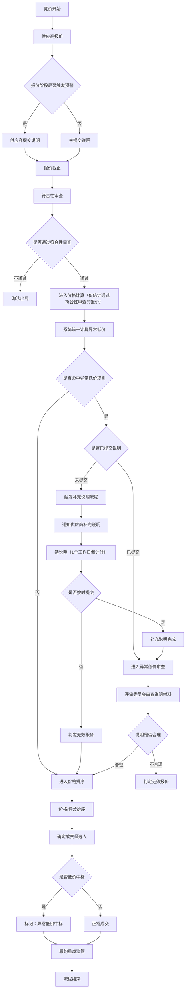

# 业务流程
## 作者：蔚然

```mermaid
flowchart TD

A[竞价开始] --> B[供应商报价]

B --> C{报价阶段是否触发预警}
C -->|是| C1[供应商提交说明]
C -->|否| C2[未提交说明]

C1 --> D[报价截止]
C2 --> D

D --> E[符合性审查]

E --> F{是否通过符合性审查}
F -->|不通过| G[淘汰出局]
F -->|通过| H[进入价格计算（仅统计通过符合性审查的报价）]

H --> I[系统统一计算异常低价]

I --> J{是否命中异常低价规则}

J -->|否| K[进入价格排序]

J -->|是| L{是否已提交说明}

L -->|已提交| M[进入异常低价审查]
L -->|未提交| N[触发补充说明流程]

N --> O[通知供应商补充说明]
O --> P[待说明（1个工作日倒计时）]

P --> Q{是否按时提交}
Q -->|是| R[补充说明完成]
Q -->|否| S[判定无效报价]

R --> M
S --> K

M --> T[评审委员会审查说明材料]

T --> U{说明是否合理}
U -->|合理| K
U -->|不合理| V[判定无效报价]

K --> W[价格/评分排序]
W --> X[确定成交候选人]

X --> Y{是否低价中标}
Y -->|是| Z[标记：异常低价中标]
Y -->|否| AA[正常成交]

Z --> AB[履约重点监管]
AA --> AB

AB --> AC[流程结束]
```