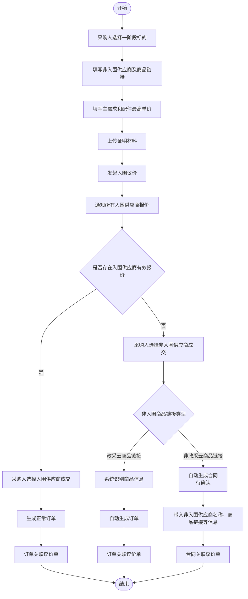

# 吉林框架协议合同授予非入围供应商需求

为支持政府采购中采购人依法以更低价格向非入围供应商采购相同货物，同时优先保障入围供应商的报价机会，平台新增“入围议价”交易方式。该机制允许采购人基于非入围供应商低价证明，发起以非入围价格为上限的线上议价，若入围供应商未响应，则可与非入围供应商成交并实现订单或合同与原议价过程的闭环关联，确保流程合规、留痕完整。
关键要点包括：
1. 【依法合规开展同品低价采购】依据财政部令第110号规定，采购人在证明非入围供应商价格更低且入围供应商不愿降价时，可选择非入围供应商成交。
2. 【新增“入围议价”交易方式】采购人可发起以非入围供应商报价为最高单价的议价，邀请对应标的下所有入围供应商在限价内报价，优先保障其竞争机会。
3. 【全流程线上留痕与闭环管理】议价过程、报价结果、成交信息及证明材料均系统留痕，订单或合同自动关联议价单，形成完整业务和监管追溯链条。
4. 【差异化成交路径处理】若有入围供应商报价，采购人可从中选商生成订单；若无有效报价，则可选择非入围供应商成交，政采云链接自动生成订单，非政采云链接暂定自动生成合同。
5. 【标准化配置与状态管控】支持按区划、品目等维度配置启用规则，明确报价、确认时限，并定义草稿、待报价、已成交、已作废等全生命周期状态流转。
---

# 背景

财政部令第110号《政府采购框架协议采购方式管理暂行办法》第三十七条规定：采购人证明能够以更低价格向非入围供应商采购相同货物，且入围供应商不同意将价格降至非入围供应商以下的，可以将合同授予非入围供应商。

当前框架协议采购场景中，部分采购人发现框架协议内商品价格高于同期市场价格。为支持采购人依法开展同品低价采购，并优先保障入围供应商的报价机会，平台需要提供一种新的交易方式：采购人以非入围供应商供应价作为最高单价，邀请入围供应商报价；若无入围供应商报价，再支持采购人与非入围供应商成交并完成订单或合同关联。

# 当前问题

1.  采购人发现非入围供应商可提供更低价格时，平台缺少标准化流程承接该类交易。
    
2.  入围供应商是否愿意降价缺少线上留痕，采购人难以完整证明已向入围供应商提供报价机会。
    
3.  无入围供应商报价后，采购人与非入围供应商成交的订单、合同与原竞价过程缺少统一关联。
    
4.  证明材料、最高单价、报价结果、成交结果、公示信息分散，后续监管和审计追溯成本较高。
    

# 目标

新增交易方式“入围议价”，支持采购人在证明非入围供应商可提供更低价格的前提下，选择一阶段标的发起议价，邀请该标的下所有入围供应商在最高单价内报价。

系统需满足：

1.  入围供应商有报价时，采购人可选择任一入围供应商成交，并生成正常订单。
    
2.  入围供应商均未报价时，采购人可选择非入围供应商成交。
    
3.  非入围供应商成交时，暂定按商品链接类型处理：政采云商品链接自动生成订单；非政采云商品链接自动生成合同，并将非入围供应商名称、商品链接等相关信息带入合同。该逻辑待确认。
    
4.  订单或合同需关联至议价单，形成完整业务闭环。
    
5.  议价过程、报价结果、成交结果和证明材料支持留痕及公示。
    

# 术语定义

| 术语 | 说明 |
| --- | --- |
| 入围议价 | 采购人基于非入围供应商低价证明，邀请框架协议入围供应商在最高单价内报价的交易方式 |
| 一阶段标的 | 框架协议第一阶段征集形成的标的或商品范围 |
| 入围供应商 | 已入围该一阶段标的的供应商 |
| 非入围供应商 | 未入围该一阶段标的，但采购人证明其可提供相同货物且价格更低的供应商 |
| 最高单价 | 采购人根据非入围供应商供应单价设置的报价上限，主需求和配件均需分别填写 |
| 预算总价 | 系统根据数量和最高单价自动计算的预算金额，不支持采购人手工填写 |
| 议价成功 | 至少有一个入围供应商提交有效报价 |
| 议价失败 | 议价截止后无入围供应商提交有效报价 |

# 业务流程

# 产品方案

## 1. 新增交易方式

新增交易方式：入围议价。

该交易方式用于框架协议采购场景，适用于采购人已取得非入围供应商更低供应价，并需先邀请入围供应商降价响应的业务。

## 2. 配置能力

在交易业务规则中增加“入围议价”开关。

| 配置项 | 说明 |
| --- | --- |
| 是否启用入围议价 | 控制采购人是否可发起入围议价 |
| 适用区划 | 支持按区划启用 |
| 适用品目/类目 | 支持限定适用的集采目录、框架协议品目或商品类目 |
| 创建页顶部提示文案 | 支持按区划或交易方式配置，展示在采购人创建页顶部 |
| 竞价开始时间 | 支持配置默认开始规则 |
| 报价截止时间 | 支持配置默认报价时长或截止规则 |
| 结果确认时限 | 支持配置默认确认时限，超期未确认时按现有规则处理 |
| 是否要求证明材料 | 默认要求 |
| 是否公示议价结果 | 默认公示，具体公示范围按现有公告规则执行 |

## 3. 发起入口

支持以下入口发起：

1.  商品详情页：采购人在框架协议商品详情页发起入围议价。
    
2.  后台发起页：采购人在竞价/框架协议采购后台选择一阶段标的后发起。
    

发起时需填写或上传：

| 字段 | 要求 |
| --- | --- |
| 一阶段标的 | 必填，作为邀请入围供应商的范围依据；创建页仅支持选择一个标项 |
| 最高单价 | 必填，主需求和配件均需填写，取非入围供应商对应商品供应单价，入围供应商报价不得高于对应最高单价 |
| 预算总价 | 系统根据数量和最高单价自动计算，不支持采购人手工填写 |
| 非入围供应商 | 必填，用于记录低价来源及后续可能成交对象 |
| 非入围商品链接 | 必填，支持政采云商品链接或非政采云商品链接 |
| 证明材料 | 必填，用于证明非入围供应商符合第一阶段征集要求及可提供更低价格 |
| 议价说明 | 非必填，采购人可补充说明发起原因 |

## 3.1 采购人创建页

原型示意：

创建页基于普通竞价下单页调整，发票信息、收货地址、采购编号信息等通用模块沿用普通竞价逻辑；入围议价仅对采购需求清单、供应商要求、竞价规则和页面配置项做差异化处理。

### 3.1.1 顶部提示

创建页顶部展示提示文案，文案内容支持配置。

默认提示方向：因相关政策或区划规则限制，当前交易方式用于采购人证明可向非入围供应商以更低价格采购相同货物，并邀请入围供应商在最高单价内报价的场景。

### 3.1.2 基本信息

基本信息沿用普通竞价创建页逻辑。

| 字段 | 规则 |
| --- | --- |
| 项目名称 | 必填，沿用普通竞价校验 |
| 联系人 | 必填，默认带入当前采购人联系人，支持修改 |
| 联系电话 | 必填，沿用普通竞价手机号/座机校验 |

### 3.1.3 采购需求清单

采购需求清单仅支持按标项描述选择，且单个议价单只能选择一个标项。

| 页面项 | 规则 |
| --- | --- |
| 选择标项 | 仅支持选择一个标项；选择后带出需求名称、规格描述、采购目录、数量、单位、配件等信息 |
| 预算总价 | 系统自动计算，不支持手工填写 |
| 最高单价 | 新增字段，主需求和配件均必填 |
| 主需求最高单价 | 采购人填写，作为主需求报价上限，并用于计算主需求预算金额 |
| 配件最高单价 | 采购人填写，作为对应配件报价上限，并用于计算对应配件预算金额 |
| 数量 | 沿用标项数量；如页面允许调整，预算总价需随数量变化实时重算 |
| 采购人需求描述 | 沿用普通竞价逻辑，支持采购人补充说明 |

预算总价计算规则：

| 场景 | 计算方式 |
| --- | --- |
| 仅有主需求 | 预算总价 = 主需求数量 × 主需求最高单价 |
| 主需求包含配件 | 预算总价 = 主需求数量 × 主需求最高单价 + Σ 配件数量 × 配件最高单价 |

提交校验：

1.  未选择标项时，不允许提交审核。
    
2.  选择多个标项时，不允许提交审核。
    
3.  主需求最高单价为空时，不允许提交审核。
    
4.  任一配件最高单价为空时，不允许提交审核。
    
5.  最高单价需大于0。
    
6.  预算总价由系统自动计算，采购人不可编辑。
    

### 3.1.4 采购需求附件

采购需求附件沿用普通竞价逻辑。

| 页面项 | 规则 |
| --- | --- |
| 采购需求附件 | 支持上传附件 |
| 附件模板 | 支持下载附件模板 |
| 供应商响应附件要求 | 支持选择“必须上传”或“可不上传” |
| 附件校验 | 文件数量、格式、大小沿用普通竞价限制 |

### 3.1.5 采购编号信息

采购编号信息沿用普通竞价逻辑。

系统按当前采购单位可用采购编号展示已关联和未关联金额；当前创建页没有采购编号时，展示暂无数据。

### 3.1.6 供应商要求

供应商要求沿用新供应商要求规则，不做系统默认预置。

页面支持采购人新增常用要求或自定义要求；新增要求的展示、编辑、删除、供应商响应方式、是否必须响应等能力沿用新供应商要求规则。

### 3.1.7 竞价规则

入围议价的报价规则和成交规则固定，不允许采购人修改。

| 规则项 | 固定值 |
| --- | --- |
| 响应方式 | 选择具体商品响应采购需求，并报价 |
| 推荐成交供应商 | 最低报价 |
| 有效标准 | 有效报价供应商不少于1家 |
| 确认方式 | 采购人在有效报价的供应商中，手动确认成交供应商 |

时间规则读取交易方式配置：

| 规则项 | 规则 |
| --- | --- |
| 报价时间 | 读取配置的报价持续时长或截止规则 |
| 结果确认 | 读取配置的确认时限；超期未确认时按现有竞价规则处理 |

### 3.1.8 发票和收货信息

发票信息、收货地址、送货方式、送货期限、备注、底部预算金额展示等，均沿用普通竞价逻辑。

页面底部保留预览公告、保存、提交审核操作。

## 4. 供应商报价

议价单发布后，系统通知该一阶段标的下所有入围供应商报价。

报价规则：

1.  供应商报价逻辑与普通竞价一致，按单价报价。
    
2.  仅该一阶段标的下的入围供应商可报价。
    
3.  入围供应商对主需求和配件的报价单价不得高于对应最高单价。
    
4.  报价截止前，入围供应商可按现有竞价规则提交或修改报价。
    
5.  报价截止后，系统统计有效报价供应商。
    
6.  无有效报价时，议价结果判定为议价失败。
    

## 5. 结果确认

### 5.1 有入围供应商报价

当存在至少一个有效报价时，采购人可选择任一入围供应商成交。

页面示意：

处理规则：

1.  结果评审页展示所有参与报价的入围供应商。
    
2.  系统默认按普通竞价逻辑推荐供应商，并展示推荐标识。
    
3.  采购人可在有效报价且响应符合的入围供应商中选择1家供应商成交。
    
4.  采购人确认结论选择“确认成交”后，可提交结果。
    
5.  采购人选择“放弃结果”时，按普通竞价放弃结果逻辑处理。
    

成交后：

1.  系统生成正常订单。
    
2.  订单关联入围议价单。
    
3.  后续按现有订单、合同、履约流程执行。
    
4.  非入围供应商不得在该议价单中成交。
    

### 5.2 无入围供应商报价

当无入围供应商提交有效报价时，采购人可选择非入围供应商成交。

页面示意：

处理规则：

1.  结果评审页展示竞价结果为“无入围供应商报价”。
    
2.  确认结论支持选择“选择非入围供应商”或“顺延”。
    
3.  采购人选择“选择非入围供应商”时，页面展示非入围供应商信息填写区。
    
4.  非入围供应商名称、商品链接为必填项。
    
5.  商品链接用于判断后续成交路径。暂定规则为：政采云商品链接自动生成订单；非政采云商品链接自动生成合同，并将非入围供应商名称、商品链接等相关信息带入合同。该逻辑待确认。
    
6.  采购人可填写原因说明、上传附件，相关能力沿用普通竞价结果确认页逻辑。
    
7.  采购人提交结果后，系统记录非入围供应商信息，并将订单或合同关联至入围议价单。
    

非入围供应商信息：

| 字段 | 要求 |
| --- | --- |
| 非入围供应商名称 | 必填，采购人手工填写 |
| 商品链接 | 必填，支持政采云商品链接或非政采云商品链接 |

成交路径暂定分为两类，最终逻辑待确认：

| 商品链接类型 | 系统处理 |
| --- | --- |
| 政采云商品链接 | 系统识别商品和供应商信息，自动生成订单，订单关联入围议价单 |
| 非政采云商品链接 | 系统自动生成合同，非入围供应商名称、商品链接等相关信息带入合同，合同关联入围议价单 |

## 6. 结果公示

议价结束后，系统生成议价结果信息并支持公示。

公示内容包含：

1.  议价单编号。
    
2.  一阶段标的信息。
    
3.  最高单价和预算总价。
    
4.  入围供应商报价情况。
    
5.  成交供应商。
    
6.  成交金额。
    
7.  成交路径：入围供应商成交、非入围政采云订单成交、非入围非政采云合同成交（待确认）。
    

证明材料是否公示按监管要求及现有公告规则控制；至少需在系统内留痕备查。

## 7. 作废规则

议价结果允许作废。

作废规则：

1.  已生成订单但未进入不可作废状态时，可按订单作废规则处理。
    
2.  已生成合同的，需先按合同流程完成合同作废或撤回，再同步更新议价单状态。
    
3.  议价单作废后，不允许继续成交。
    
4.  作废原因需记录并留痕。
    

# 规则 / 逻辑

## 1. 发起校验

| 校验项 | 规则 |
| --- | --- |
| 交易方式开关 | 未启用入围议价时，采购人不可发起 |
| 一阶段标的 | 必须存在有效的入围供应商范围 |
| 最高单价 | 主需求和配件均必填，且需大于0 |
| 预算总价 | 系统自动计算，不支持采购人填写 |
| 非入围供应商 | 必填，需完成供应商主体信息记录 |
| 商品链接 | 必填，需区分政采云商品链接和非政采云商品链接 |
| 证明材料 | 必填，未上传不得发布 |

## 2. 报价校验

| 校验项 | 规则 |
| --- | --- |
| 报价供应商范围 | 仅该一阶段标的下的入围供应商可报价 |
| 报价上限 | 主需求和配件的报价单价不得高于对应最高单价 |
| 报价时间 | 仅报价期内可提交报价 |
| 有效报价 | 满足供应商范围、报价上限、报价时间的报价计为有效报价 |

## 3. 成交规则

| 场景 | 成交规则 |
| --- | --- |
| 有入围供应商有效报价 | 采购人可选择任一有效报价的入围供应商成交 |
| 无入围供应商有效报价 | 采购人可选择发起时记录的非入围供应商成交 |
| 非入围供应商提供政采云商品链接 | 自动生成订单 |
| 非入围供应商提供非政采云商品链接 | 暂定自动生成合同，并将非入围供应商名称、商品链接等相关信息带入合同 |
| 订单或合同生成后 | 必须回写并关联议价单 |

## 4. 状态流转

| 状态 | 说明 |
| --- | --- |
| 草稿 | 采购人创建但未发布 |
| 待报价 | 已发布，入围供应商可报价 |
| 待确认结果 | 报价截止，等待采购人确认成交 |
| 已成交 | 已生成订单或已关联合同 |
| 已作废 | 议价单或议价结果被作废 |
| 已流标 | 可选状态，如业务要求区分采购人未确认成交或主动终止 |

# 页面交互要求

## 1. 采购人发起页

1.  展示交易方式“入围议价”。
    
2.  支持选择一阶段标的，并展示该标的下入围供应商数量。
    
3.  支持录入主需求和配件最高单价，并自动计算预算总价。
    
4.  支持填写非入围供应商信息和商品链接。
    
5.  商品链接需让采购人选择链接来源：政采云商品链接、非政采云商品链接。
    
6.  支持上传证明材料，未上传时禁止发布。
    

## 2. 入围供应商报价页

1.  展示一阶段标的、最高单价、预算总价、报价截止时间。
    
2.  报价输入框沿用普通竞价逻辑，校验报价单价不得高于对应最高单价。
    
3.  报价成功后展示当前报价记录。
    
4.  报价截止后不允许新增或修改报价。
    

## 3. 采购人结果确认页

1.  有有效报价时，展示入围供应商报价列表，采购人可选择成交供应商。
    
2.  有有效报价时，页面展示报价供应商、报价金额、报价时间、响应符合情况、修改审查结果、投诉等信息，字段和操作沿用普通竞价逻辑。
    
3.  采购人确认成交并提交后，系统生成正常订单。
    
4.  无有效报价时，展示非入围供应商成交入口。
    
5.  无有效报价且选择非入围供应商时，展示非入围供应商名称、商品链接填写项。
    
6.  非入围供应商名称、商品链接未填写时，不允许提交结果。
    
7.  非入围成交时，根据商品链接类型引导采购人进入自动下单或自动生成合同流程；非政采云商品链接自动生成合同逻辑待确认。
    
8.  结果确认后展示关联订单或关联合同。
    

## 4. 议价单详情页

1.  展示议价单基本信息、最高单价、预算总价、证明材料、报价情况、成交结果。
    
2.  展示关联订单或关联合同。
    
3.  支持查看作废记录。
    
4.  支持查看结果公示信息。
    

# 数据记录

| 数据 | 来源 | 用途 |
| --- | --- | --- |
| 一阶段标的 | 采购人选择 | 确定入围供应商邀请范围 |
| 最高单价 | 采购人填写 | 控制入围供应商主需求和配件报价上限，并计算预算总价 |
| 预算总价 | 系统计算 | 展示采购预算，不作为采购人手工输入项 |
| 非入围供应商 | 采购人填写或选择 | 记录低价来源及失败后的成交对象 |
| 商品链接 | 采购人填写 | 判断后续自动下单或自动生成合同路径；非政采云商品链接自动生成合同逻辑待确认 |
| 证明材料 | 采购人上传 | 合规留痕及监管备查 |
| 入围供应商报价 | 供应商提交 | 判断议价成功/失败及成交选择 |
| 订单编号 | 系统生成 | 关联议价单 |
| 合同编号 | 系统生成合同后产生 | 关联议价单 |